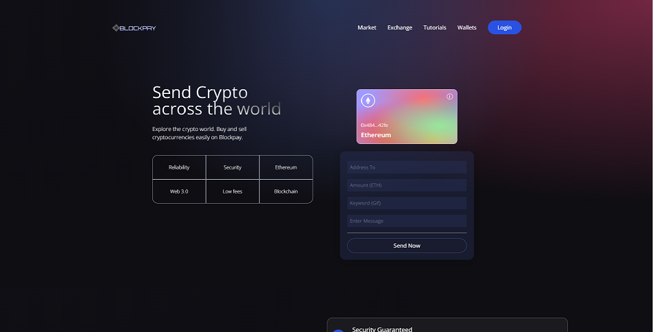
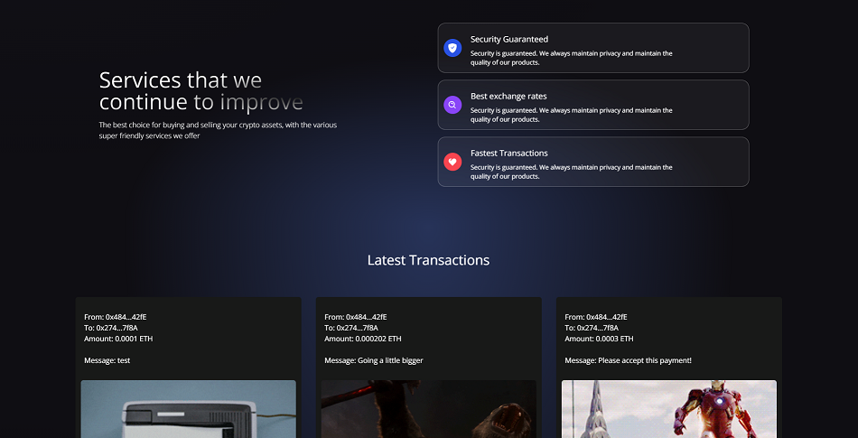
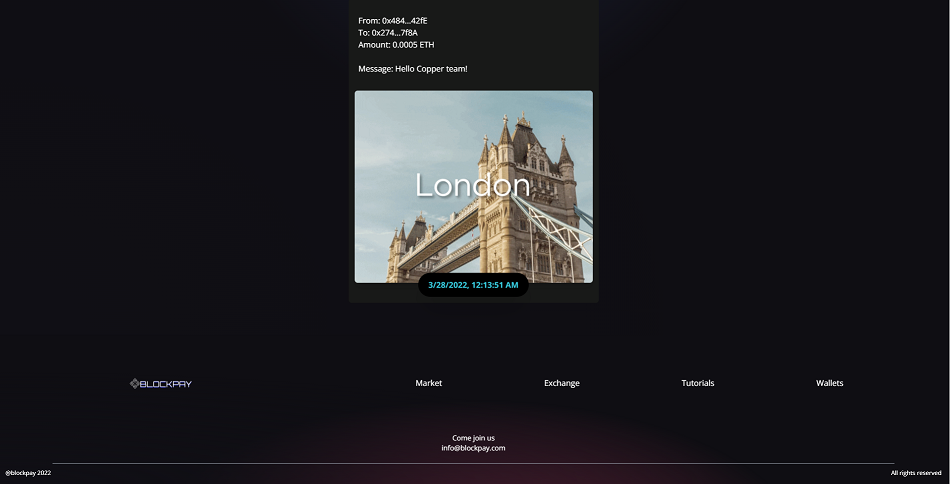

# Blockpay

For full functionality please download metamask at the following link. https://metamask.io/download/

You can receive free test tokens to use by going to the following link https://faucet.egorfine.com/ Simply enter in your desired Ropsten Test Network wallet address to send the tokens to.

Blockpay is designed to function similarly to venmo. To use this app the user would login with metamask.
Once logged in, the user can toggle between accounts and see several identifiable characters related to their account in the gradient colored card.
In the form card below, the user would fill out the fields for the following: address to send ETH, amount (ETH), keyword for a gif, and a message.
Once the fields are filled out, the user is ready to complete their transaction and send ETH by clicking the "Send Now" button.
After a moment, the transaction finishes sending and the user can view their latest transactions below, which are also timestamped, include a gif, and saved to the blockchain.

The project was created using the Vite framework and utilizes Adobe Creative Cloud for the logo, TailwindCSS, and Ethers.
For smart contract testing Hardhat (https://github.com/nomiclabs/hardhat) was utilized.

Check it out at the following link: https://blockpay916.netlify.app/

